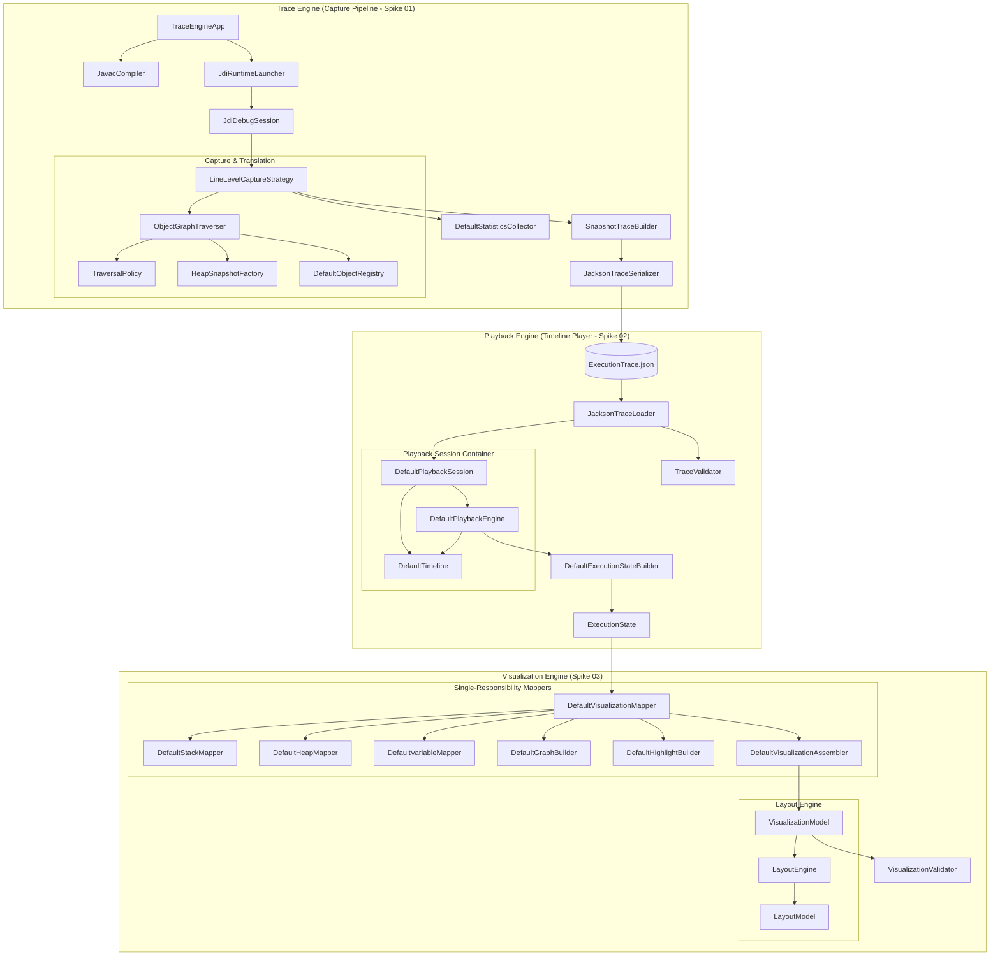

# Execution Studio — Overall Architecture

This document describes the architectural design and system components of **Execution Studio**, covering the **Trace Engine (Spike 01)**, **Playback Engine (Spike 02)**, and **Visualization Model (Spike 03)**.

---

## 1. System Vision & Data Flow

The platform is structured as a unidirectional, stateless state transformation pipeline:

```
Java Source
    │
    ▼
Trace Engine (Spike 01 - capturing JVM state via JDI)
    │
    ▼
ExecutionTrace (JSON schema on disk)
    │
    ▼
Playback Engine (Spike 02 - JDI-free timeline stepping and index pointers)
    │
    ▼
ExecutionState (Reconstructed runtime state)
    │
    ▼
Visualization Mapper (Spike 03 - stateless, Single-Responsibility mapping)
    │
    ▼
VisualizationModel (Generic, renderer-independent presentation layout DTO)
    │
    ▼
Presentational Renderer (HTML/React, CLI, JavaFX, etc.)
```

---

## 2. Unified System Components

The combined system is divided into decoupled pipeline stages:



---

## 3. Component Responsibilities

### Trace Engine (Capture Pipeline)

| Component | Responsibility |
|---|---|
| **`TraceEngineApp`** | CLI entry point. Orchestrates the pipeline: compile → initialize context → launch/capture → build → serialize. |
| **`JavacCompiler`** | Compiles `.java` files with full debug flags (`-g`) enabled. Identifies user-defined class structures to filter capture events. |
| **`JdiRuntimeLauncher`** | Starts the target JVM suspended at startup, configuring JDI debug wire parameters. |
| **`JdiDebugSession`** | Orchestrates the JDI event queue (ClassPrepare, Step, Exception, VMDeath). Excludes JDK internals and confines stepped breakpoints to user classes. |
| **`ObjectGraphTraverser`** | Recursively traverses variables in stack frames, translates JDI proxy values, and enforces depth/size limits using `TraversalPolicy` and DTO mapping in `HeapSnapshotFactory`. |
| **`DefaultObjectRegistry`** | Maps JDI's runtime object unique IDs to stable synthetic identifiers (`"obj_N"`) to establish tracking reference stability. |
| **`SnapshotTraceBuilder`** | Accumulates execution events sequentially and structures the final trace metadata. |
| **`JacksonTraceSerializer`** | Serializes the final trace records to formatted JSON on disk. |

### Playback Engine (Timeline Player)

| Component | Responsibility |
|---|---|
| **`JacksonTraceLoader`** | Deserializes JSON traces into immutable DTO arrays using Jackson polymorphic type handling. |
| **`TraceValidator`** | Performs semantic checks on loaded traces (validates version schemas, monotonic sequence ordering, object reference mapping completeness, and heap array lengths). |
| **`DefaultPlaybackSession`** | The root container managing trace, navigation pointers (`Timeline`), progress metrics (`PlaybackMetadata`), and engine states. |
| **`DefaultTimeline`** | Pure index-based step navigator decoupled from execution data structures. |
| **`DefaultPlaybackEngine`** | Translates player navigation inputs (`next()`, `previous()`, `seek(index)`) by fetching active pointers and delegating state reconstruction. |
| **`DefaultExecutionStateBuilder`** | Reconstructs the JDI-free program runtime hierarchy (`ExecutionState`) at any specific step index. |

### Visualization Layer (Presentation Mapper)

| Component | Responsibility |
|---|---|
| **`DefaultVisualizationMapper`** | Stateless orchestrator mapping runtime states to visualization models. |
| **`DefaultStackMapper`** | Converts stack frames to active stack views. |
| **`DefaultHeapMapper`** | Maps objects and arrays to heap DTO views. |
| **`DefaultVariableMapper`** | Maps active variables, translates display values, and handles variable change detection by comparing values against previous steps. |
| **`DefaultGraphBuilder`** | Constructs the generic directed reference graph representing object connections. |
| **`DefaultHighlightBuilder`** | Formulates highlights and categorizes focuses (`HighlightReason`). |
| **`DefaultVisualizationAssembler`** | Consolidates sub-views and exception contexts into the final `VisualizationModel` under the clean presentational execution status (`ExecutionStatus`). |
| **`LayoutEngine`** | Calculates layout coordinates positions and returns an immutable `LayoutModel` map of coordinates points (`Point2D`). |
| **`VisualizationValidator`** | Semantic visual model checks (rejects duplicate graph node IDs, dangling edges, and inconsistent highlight targets). |

---

## 4. Visualization Mapping Hierarchy

The visualization mapping translates runtime representations to presentation DTOs:

- **Display Values (`DisplayValue`)**: Hides JVM types by converting primitive parameters to simple strings, reference maps, and null visual shapes.
- **Reference Graph**: Exposes object nodes (`GraphNode` with `NodeType`) and connections (`GraphEdge` with `EdgeType`) for graph engines.
- **Execution Highlights (`HighlightState`)**: Groups focused target IDs and highlights reasons (`HighlightReason`) for animation frames.
- **Execution Status (`ExecutionStatus`)**: Expresses standard lifecycle states (`RUNNING`, `COMPLETED`, `EXCEPTION`).

---

## 5. Design Decisions & Trade-Offs

- **Stateless Pure Mapping**: Moving variable change detection directly to the mapper eliminates memory state caching inside presentation session objects. The mapper remains stateless and fully deterministic.
- **Separation of Concerns**: Granular sub-mappers ensure that layout, stack frame pointers, variables comparison, and object reference graph builders remain completely decoupled. This slightly increases class footprint but guarantees single-responsibility and test safety boundaries.
- **Immutable Layout Engine**: By separating coordinates calculations into an immutable position mapping (`LayoutModel`), we avoid mutating visualization DTOs, keeping visual snapshots safe for concurrent UI renderers.
