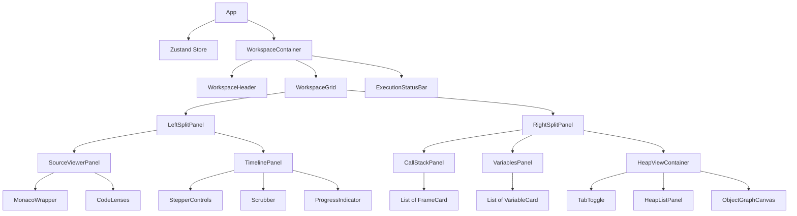
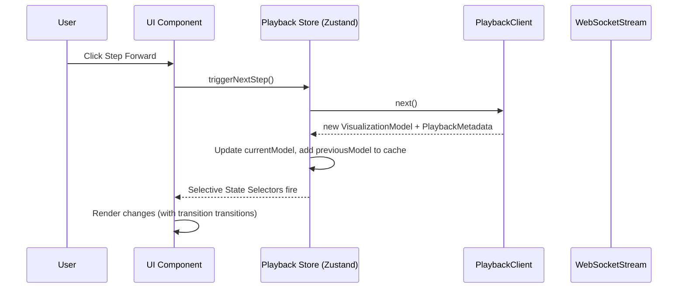

# Execution Studio — Frontend Architecture Specification (Spike 04)

This document specifies the frontend architecture for **Execution Studio** (Spike 04). The frontend is a presentation-only web client (React / TypeScript / HTML5 Canvas) that displays program execution state.

---

## 1. Architectural Principles & Boundaries

- **Zero Runtime Logic:** The frontend has **no JDI, JVM, compiler, or playback state reconstruction logic**. It acts as a presentational client.
- **Strict DTO Boundaries:** The frontend consumes **only** the `VisualizationModel` and `PlaybackMetadata` JSON schemas exposed by the Playback Engine. It does not import or depend on `ExecutionState`, `ExecutionTrace`, or backend tracing libraries.
- **Unidirectional Data Flow:** Data updates flow exclusively from the playback controllers/connections to the store, and propagate downward to the presentation components.
- **Visual Stability:** Components remain visually stable during stepping transitions. Layout configurations (like object graphs) morph dynamically rather than rebuilding canvas objects on every step.

---

## 2. Directory Layout & Folder Structure

We use a feature-focused modular React directory structure.

```text
execution-studio-frontend/
├── public/                            # Static assets (favicons, loading screens)
├── src/
│   ├── api/                           # Network boundary
│   │   ├── PlaybackClient.ts          # HTTP client communicating with backend session
│   │   └── WebSocketStream.ts         # Live execution stream connection handler
│   │
│   ├── types/                         # Visual DTO interfaces
│   │   ├── visualization.types.ts     # TypeScript equivalents of VisualizationModel DTOs
│   │   └── metadata.types.ts          # TypeScript equivalents of PlaybackMetadata DTOs
│   │
│   ├── store/                         # State management
│   │   ├── usePlaybackStore.ts        # Zustand store managing session metadata, cache, speed
│   │   └── useLayoutStore.ts          # Handles screen panels proportions & canvas scale
│   │
│   ├── components/                    # Generic Presentational UI Components
│   │   ├── SplitPane.tsx              # Resizable panel splitter
│   │   ├── Button.tsx                 # Sleek dark-mode button
│   │   ├── Scrubber.tsx               # Linear progress slider
│   │   └── Card.tsx                   # Container with glassmorphism hover effects
│   │
│   ├── features/                      # Domain Modules
│   │   ├── workspace/
│   │   │   └── WorkspaceContainer.tsx # Core layout wrapper (grid config)
│   │   │
│   │   ├── timeline/
│   │   │   ├── TimelinePanel.tsx      # Scrubber and controls container
│   │   │   ├── StepperControls.tsx    # Forward, back, restart, speed buttons
│   │   │   └── ProgressIndicator.tsx  # Execution metadata (step index, percentage)
│   │   │
│   │   ├── source-viewer/
│   │   │   ├── SourceViewerPanel.tsx  # Tabs container
│   │   │   ├── MonacoWrapper.tsx      # Monaco Editor wrapper (delta decorations)
│   │   │   └── CodeLenses.tsx         # Inline visual variables overlay manager
│   │   │
│   │   ├── stack/
│   │   │   ├── CallStackPanel.tsx     # FrameView listing panel
│   │   │   ├── FrameCard.tsx          # Call frame details (isActive highlight)
│   │   │   └── ScopeTabs.tsx          # Swapping variables scopes tabs
│   │   │
│   │   ├── variables/
│   │   │   ├── VariablesPanel.tsx     # Scoped variables grid
│   │   │   └── VariableCard.tsx       # Variable values (changed flags flash animation)
│   │   │
│   │   └── heap/
│   │       ├── HeapViewContainer.tsx  # Tab toggle (Heap Cards list vs Object Graph)
│   │       ├── HeapListPanel.tsx      # Linear cards listing object fields
│   │       └── ObjectGraphCanvas.tsx  # Canvas/Cytoscape.js object references graph
│   │
│   ├── layout/                        # Canvas layout configurations
│   │   ├── GraphLayoutEngine.ts       # Coordinate calculator hooks
│   │   └── workers/
│   │       └── forceLayout.worker.ts  # Web Worker executing D3-force positioning
│   │
│   ├── utils/                         # Presentational formatting
│   │   ├── valueFormatter.ts          # Formats DisplayValue objects to visual text
│   │   └── graphAdapter.ts            # Maps ReferenceGraph edge/nodes to Cytoscape format
│   │
│   ├── App.tsx                        # Root bootstrap component
│   ├── index.css                      # Design tokens (dark-mode colors, animations)
│   └── main.tsx                       # React DOM mounting entry
```

---

## 3. Component Hierarchy



---

## 4. State Management Strategy

To ensure fluid timeline transitions, the client maintains state using **Zustand** (a lightweight, flux-like store). This decouples high-frequency data ticks (e.g. stepping at 20fps) from the React rendering trees, avoiding unnecessary global renders.



### Store Structure
```typescript
interface PlaybackState {
  currentModel: VisualizationModel | null;
  previousModel: VisualizationModel | null;
  metadata: PlaybackMetadata | null;
  isPlaying: boolean;
  playSpeed: number; // steps/sec
  stepCache: Map<number, VisualizationModel>; // In-memory client cache
  connectionStatus: 'CONNECTED' | 'DISCONNECTED' | 'CONNECTING';
  
  // Actions
  loadSession(sessionId: string): Promise<void>;
  stepForward(): Promise<void>;
  stepBackward(): Promise<void>;
  seek(index: number): Promise<void>;
  togglePlay(): void;
  setSpeed(speed: number): void;
}
```

---

## 5. Timeline Interaction Model

### Linear Scrubber Navigation
- A custom horizontal slider is mapped directly to `metadata.currentStepIndex` with range `[0, metadata.totalSteps - 1]`.
- **Throttled Seeking:** While dragging the scrubber, the store queries the local cache first. If a cache miss occurs, the API seek request is throttled (100ms delay) to prevent hammering the backend.

### Keyboard Shortcuts
We register global event listeners (using a custom hook `useHotkeys`):
- `RightArrow` / `L` -> Step Forward
- `LeftArrow` / `H` -> Step Backward
- `Space` -> Toggle Auto-Play
- `R` -> Restart

---

## 6. Rendering Pipelines & Visual Optimizations

### 6.1 Monaco Editor Integration
The source code viewer runs in read-only mode inside Monaco Editor.
- **Stepping Line Highlight:** When `currentModel` updates, we use Monaco's decoration API:
  ```typescript
  editor.deltaDecorations(prevDecorations, [
    {
      range: new monaco.Range(line, 1, line, 1),
      options: {
        isWholeLine: true,
        className: 'active-execution-line-decoration',
        glyphMarginClassName: 'active-execution-glyph-decoration'
      }
    }
  ]);
  ```
- **Code Lenses:** Variables from `currentModel.variables` are displayed directly inline next to their occurrence in the editor using Monaco overlay widgets. Highlights are applied to variables with the `CHANGED` highlight reason.

### 6.2 Call Stack & Variables Panels
- **Framing & Locals:** The variables list corresponds to `currentModel.variables.variables`. We display name, declared type, and visual values.
- **Value Change Animations:** A CSS transition animation is triggered if `variable.changed === true`.
  ```css
  @keyframes highlight-change {
    0% { background-color: rgba(229, 100, 100, 0.4); }
    100% { background-color: transparent; }
  }
  .variable-card.changed {
    animation: highlight-change 1.2s ease-out;
  }
  ```
- **Custom tab selectors:** If a user clicks a lower stack frame, we display the local variables scoped to that frame.

### 6.3 Heap Visualization Panels
- **Tab 1: Linear List View:** Standard cards listing all active heap objects.
- **Tab 2: Object Graph Visualizer:** Powered by **Cytoscape.js** or **D3-force** inside an HTML5 Canvas container.
  - Nodes: Represent objects (`NodeType.OBJECT`) or arrays (`NodeType.ARRAY`).
  - Edges: Represent fields (`EdgeType.FIELD`) or index elements (`EdgeType.ARRAY_ELEMENT`).
  - **Dynamic Layout Positioning:** Cytoscape/D3 maps coordinates by checking the `LayoutModel` positions returned by the `LayoutEngine`.
  - **Force-Directed Fallback:** If the layout model doesn't specify coordinates, the frontend runs a force-directed layout. To keep rendering smooth, force calculations are run in a **Web Worker** (`forceLayout.worker.ts`) to avoid blocking the main UI thread.
  - **Node Positioning Interpolation (Morphing):** When the step changes, nodes are transitioned smoothly using animators (e.g. `anime.js` or Cytoscape's `.animate()` layout modifiers) rather than redraws, allowing developers to visually track changes.

---

## 7. Performance Considerations for Large Traces

- **Client-Side Cache:** Stores up to 100 historical visual model steps in a HashMap. Prevents layout lag when stepping backward or replaying steps.
- **Virtualization:** For deep arrays (e.g. `int[1000]`), list renders use windowing via `react-window` to limit active DOM counts.
- **Web Worker Layout Offloading:** Complex force-directed layout calculations run in dedicated Web Workers. Coordinates are communicated back to the main thread via message passes.
- **React.memo Boundaries:** Frames and heap lists check value changes and skip rendering if the respective model sections (`StackView`, `HeapView`) have not updated.

---

## 8. Error Handling Strategy

- **React Error Boundaries:** Individual visualization panels (variables panel, code viewer, graph panel) are wrapped in separate boundaries. If Cytoscape crashes on an invalid layout edge, the rest of the application remains responsive, displaying an error fallback:
  ```tsx
  <ErrorBoundary fallback={<GraphFallbackError />}>
    <ObjectGraphCanvas model={model} />
  </ErrorBoundary>
  ```
- **Trace loader disconnect alerts:** Displays status banners if WebSocket streaming drops, automatically attempting to reconnect with exponential backoff timers.

---

## 9. Frontend Verification Plan

Since we are not implementing components yet, we specify the automated and manual testing strategies for verification:

### Automated Frontend Tests
1. **Zustand Store Unit Tests (Vitest):**
   - Mock API client responses.
   - Assert that invoking `stepForward()` populates `currentModel`, sets `previousModel`, and correctly updates the `stepCache`.
   - Assert that scrubbing to index $N$ triggers throttled API requests.
2. **Adapter Utility Tests:**
   - Verify `graphAdapter.ts` converts a `ReferenceGraph` JSON payload containing cyclic connections into valid Cytoscape nodes and edges arrays.
3. **Component Integration Mocking:**
   - Mock Monaco deltaDecorations calls. Assert that the correct line numbers are passed when the active step changes.

### Manual Verification
1. Run Vitest suites to confirm mock adapters, state machines, and change animation triggers run cleanly.
2. Test network reconnection logic by dropping the mock WebSocket server.
3. Confirm page responsiveness when loading mock files with over 1,000 steps.
